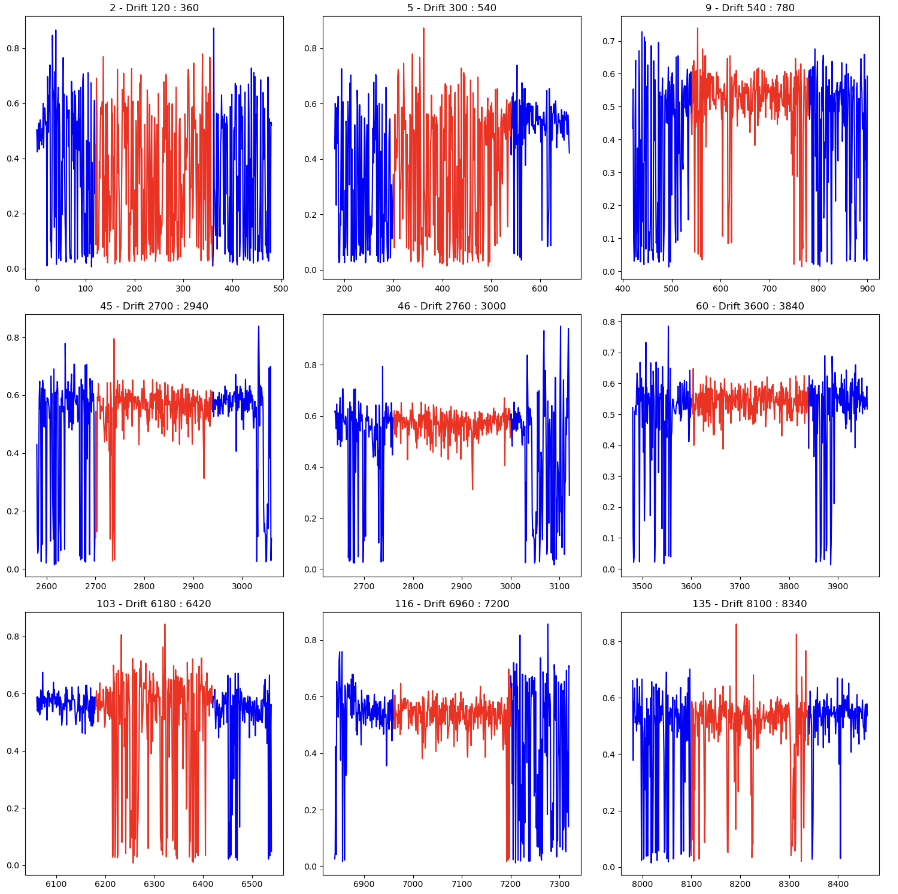
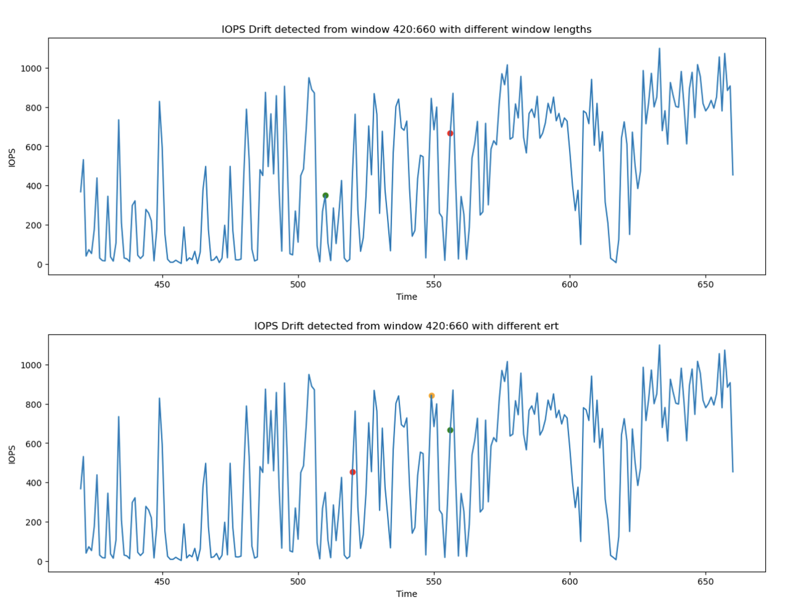

Hello! I'm Joanna! Over the past month, I have been contributing to the [ML in Detecting and Addressing System Drift](/project/osre24/anl/last) project under the mentorship of [Ray Andrew](https://ucsc-ospo.github.io/author/ray-andrew-sinurat/)  and [Sandeep Madireddy](https://ucsc-ospo.github.io/author/sandeep-madireddy/). My project aims to design a pipeline to evaluate drift detection algorithms on system traces. The goal is to characterize different drifts, understand how they affect model performance, and evaluate the performance of state-of-the-art (SOTA) drift detection algorithms.

# Progress

Here is some background on my project: Model drift, or the degradation of model performance, is typically caused by data drift, which is a shift in the input distribution, and concept drift, which is a change in the relationship between input and output. The project aims to detect both data drifts and concept drifts, analyze these drifts, and try to improve the model performance in computer system.

Over the past month, I’ve primarily been constructing a data drift dataset from the Tencent I/O block trace, which includes both drift and non-drift data. By combining offline drift detection algorithms such as Maximum Mean Discrepancy, Cramér-von Mises, and Kolmogorov-Smirnov, I am developing a dataset that contains segments with and without drifts for features such as IOPS (Input/Output Operations Per Second), read/write size ratio, write size, and other relevant performance metrics. The diagrams below illustrate the data segments identified with and without drifts, respectively.

In addition to constructing the datasets, I have begun evaluating some online drift detection algorithms and designing metrics to assess their performance. I have tested the performance of online drift detection algorithms such as Online Maximum Mean Discrepancy and Online Cramér-von Mises under various settings, including different window lengths and sensitivity levels. The following diagrams illustrate the drift points detected for the IOPS feature under these different settings.

# Next Steps
Here are my plans for the next month:

- Complete the experiments on data drift and generate improved visualizations to summarize the performance of these online drift detection algorithms, including their overhead and accuracy over time.
- Characterize drifts by identifying the types of drifts that lead to model performance degradation
- Evaluate drift detection algorithms in the context of concept drifts.

Stay tuned for my future updates on this project!

